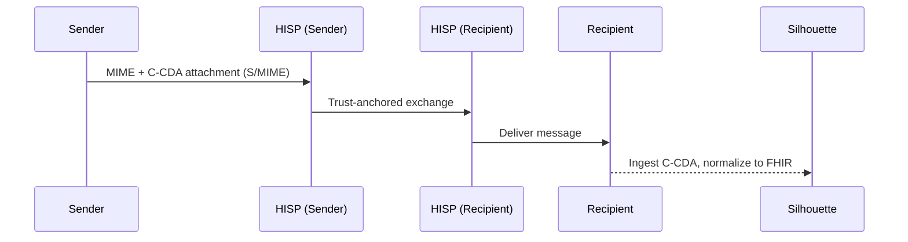

# Direct Secure Messaging (DSM) Flow

```mermaid
sequenceDiagram
  participant Sender
  participant HISP_A as HISP (Sender)
  participant HISP_B as HISP (Recipient)
  participant Recipient

  Sender->>HISP_A: MIME + C-CDA attachment (S/MIME)
  HISP_A->>HISP_B: Trust-anchored exchange
  HISP_B->>Recipient: Deliver message
  Recipient-->>Silhouette: Ingest C-CDA, normalize to FHIR
```

*Certificates managed via trust bundles; verify signatures; log DUAs/audits.*
