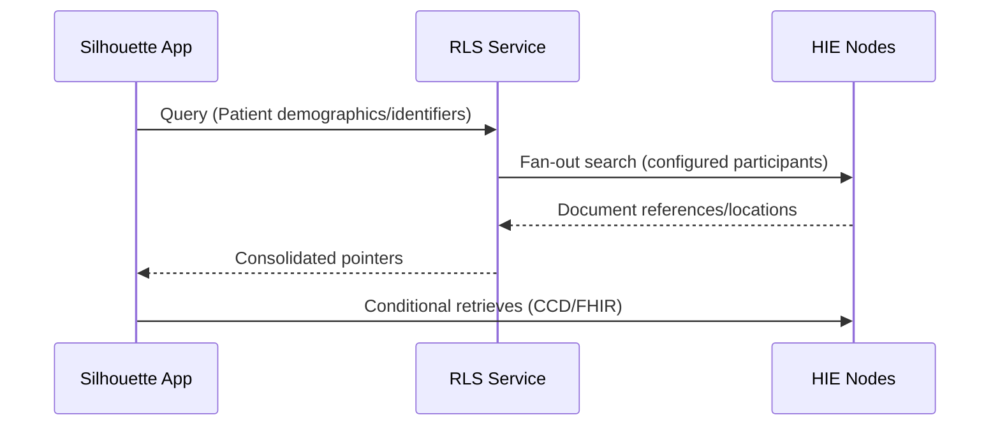

# HIE Record Locator Service (RLS) Query

```mermaid
sequenceDiagram
  participant App as Silhouette App
  participant RLS as RLS Service
  participant HIE as HIE Nodes

  App->>RLS: Query (Patient demographics/identifiers)
  RLS->>HIE: Fan-out search (configured participants)
  HIE-->>RLS: Document references/locations
  RLS-->>App: Consolidated pointers
  App->>HIE: Conditional retrieves (CCD/FHIR)
```

**Notes**

* Use PIX/PDQ for cross-identity resolution where available.
* Cache pointers with expiry; enforce consent/purpose-of-use.
