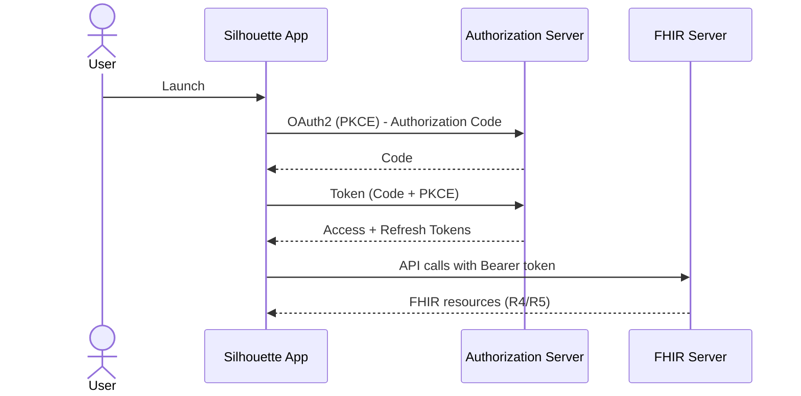

# SMART on FHIR Authorization

```mermaid
sequenceDiagram
  actor User
  participant Client as Silhouette App
  participant Auth as Authorization Server
  participant FHIR as FHIR Server

  User->>Client: Launch
  Client->>Auth: OAuth2 (PKCE) - Authorization Code
  Auth-->>Client: Code
  Client->>Auth: Token (Code + PKCE)
  Auth-->>Client: Access + Refresh Tokens
  Client->>FHIR: API calls with Bearer token
  FHIR-->>Client: FHIR resources (R4/R5)
```

*Scopes: `patient/*.read`, `user/*.read`, `offline_access`, etc.*
