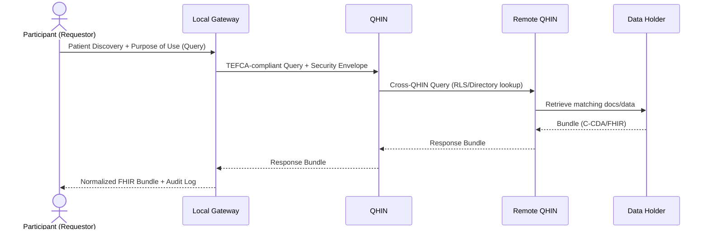

# TEFCA / QHIN Exchange Overview

```mermaid
sequenceDiagram
  actor Requestor as Participant (Requestor)
  participant Gateway as Local Gateway
  participant QHIN as QHIN
  participant RQHIN as Remote QHIN
  participant DataHolder as Data Holder

  Requestor->>Gateway: Patient Discovery + Purpose of Use (Query)
  Gateway->>QHIN: TEFCA-compliant Query + Security Envelope
  QHIN->>RQHIN: Cross-QHIN Query (RLS/Directory lookup)
  RQHIN->>DataHolder: Retrieve matching docs/data
  DataHolder-->>RQHIN: Bundle (C-CDA/FHIR)
  RQHIN-->>QHIN: Response Bundle
  QHIN-->>Gateway: Response Bundle
  Gateway-->>Requestor: Normalized FHIR Bundle + Audit Log
```

**Notes**

* Enforce TEFCA policy (purpose-of-use, consent).
* Normalize QHIN responses to FHIR Bundle for uniform downstream use.
* Full audit trail persisted.
